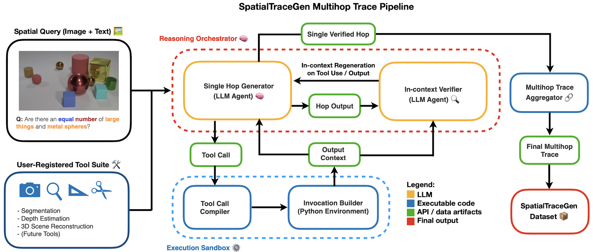

# SpatialTraceGen: A Framework for Generating Multi-Hop Spatial Reasoning Traces with LLMs

A comprehensive framework for generating spatial reasoning traces using Large Language Models (LLMs) and computer vision tools. This system enables step-by-step spatial reasoning with integrated verification, experiment management, and detailed analysis capabilities.



## Overview

Spatial Trace provides a complete pipeline for spatial reasoning research:

- **Trace Generation**: Step-by-step spatial reasoning using LLMs and computer vision tools (SAM2, DAV2, TRELLIS)
- **Verification System**: Built-in trace verification with configurable strictness levels
- **Evaluation Framework**: Comprehensive evaluation on datasets like CLEVR with automated grading
- **Experiment Management**: Organized experiment structure with result tracking and analysis
- **Tool Analysis**: Detailed analysis of tool usage patterns and distributions
- **Visualization**: Rich visualizations for tool usage, accuracy metrics, and reasoning patterns

## Key Features

### Spatial Reasoning Pipeline
- **Multi-Tool Integration**: SAM2 (segmentation), DAV2 (depth estimation), TRELLIS (3D generation)
- **LLM Interface**: Structured communication with OpenAI's GPT models
- **Reasoning Traces**: Generation of interpretable step-by-step spatial reasoning processes
- **Verification System**: Configurable verification levels (τ = 4, τ = 5) for quality control

### Evaluation & Analysis
- **Automated Evaluation**: Process large datasets with accuracy tracking
- **Tool Usage Analysis**: Comprehensive analysis of which tools are used when and where
- **Quality Assessment**: Automated grading and quality metrics

### Development & Research
- **Modular Architecture**: Clean separation of concerns across components
- **Extensible Design**: Easy to add new tools and reasoning capabilities
- **CLI Interface**: Command-line tools for batch processing and analysis

## Setup and Installation

**1. Clone the Repository**
```bash
git clone https://github.com/your-repo/SpatialTraceGen.git # Replace with your repo URL
cd SpatialTraceGen
```

**2. Create and Activate Conda Environment**
All tool execution and generation scripts are managed through a single, unified Conda environment.
```bash
# Create the environment. The name 'models' is recommended for consistency.
conda create -n models python=3.10
conda activate models
```

**3. Install Dependencies**
Install the necessary Python packages from the requirements file.
```bash
# Ensure you are in the root directory of the repository
pip install -r requirements.txt
```

**4. Set Environment Variables**
The framework requires an OpenAI API key for the Generator and Verifier models. Export it as an environment variable:
```bash
export OPENAI_API_KEY='your-key-here'
```
You will also need to ensure the paths to the external vision tools (SAM2, DAv2, TRELLIS) are correctly configured within the respective tool implementation files (`spatial_trace/spatial_trace/tools/*.py`).

## Dataset

The reasoning traces generated by this framework are stored in `spatial_trace/spatial_trace/evaluation/experiments/`. Each subdirectory corresponds to a specific experimental condition described in our paper:

- **`clevr_human_traces_WITHOUT_verification_large/`**: Corresponds to the **No Verification** baseline (τ=0) condition in the paper
- **`clevr_human_traces_WITH_basic_verification_large/`**: Corresponds to the **Basic Verification** condition (τ=4.0) in the paper
- **`clevr_human_traces_WITH_strict_verification_large/`**: Corresponds to the **Strict Verification** condition (τ=5.0) in the paper

## Reproducing Experiments from the Paper

This section provides the exact commands and locations needed to reproduce the findings in our paper.

### Generating the Reasoning Traces

Run the following commands from the repository's root directory.

**1. No Verification (Baseline, $\tau=0$)**
```bash
python -m spatial_trace.evaluation.quality_generator \
    --dataset clevr_human_subset \
    --experiment clevr_human_traces_WITHOUT_verification_large \
    --max_samples 30 \
    --no-verification
```

**2. Basic Verification ($\tau=4.0$)**
```bash
python -m spatial_trace.evaluation.quality_generator \
    --dataset clevr_human_subset \
    --experiment clevr_human_traces_WITH_basic_verification_large \
    --max_samples 30 \
    --min_rating 4.0
```

**3. Strict Verification ($\tau=5.0$)**
```bash
python -m spatial_trace.evaluation.quality_generator \
    --dataset clevr_human_subset \
    --experiment clevr_human_traces_WITH_strict_verification_large \
    --max_samples 30 \
    --min_rating 5.0
```

### Evaluating Final Answer Accuracy

To calculate the final answer accuracy for each condition as reported in our paper, run the provided evaluation scripts from the repository's root directory.

*   **For the no-verification condition ($\tau=0$):**
    ```bash
    python baseline.py
    ```

*   **For the verification conditions ($\tau=4.0$ and $\tau=5.0$):**
    ```bash
    python main.py
    ```
    *Note: You may need to modify the minimum rating parameter in `main.py` to match the verification condition you are evaluating.*
